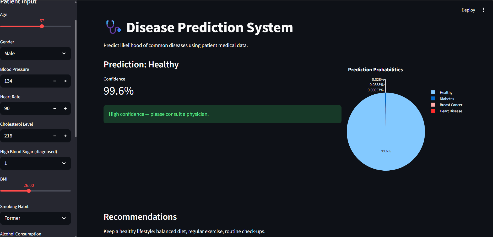

# 🩺 AI-Powered Disease Prediction System

<div align="center">


### 🚀 Real-World AI Healthcare Prediction System


</div>

---

# 📌 Project Overview

This project is an **AI-powered Disease Prediction System** developed as part of the **CodeAlpha Machine Learning Internship**.

The application predicts the likelihood of diseases using patient medical data and Machine Learning algorithms.

The system helps users analyze possible health conditions based on symptoms and medical parameters.

---

# 🎯 CodeAlpha Internship Task

## ✅ TASK 2 — Disease Prediction System

### Objective:
Predict disease likelihood using medical and patient health-related data.

### Implemented Features:
✔ Data Preprocessing  
✔ Feature Engineering  
✔ Machine Learning Classification  
✔ Streamlit Web Application  
✔ Real-Time Disease Prediction  
✔ Interactive Medical Dashboard  
✔ Probability-Based Predictions  

---

# 🧠 Machine Learning Algorithms Used

| Algorithm | Purpose |
|---|---|
| Logistic Regression | Baseline Prediction |
| Decision Tree | Rule-Based Classification |
| Random Forest | Final High Accuracy Model |

---

# 📊 Model Evaluation Metrics

✅ Accuracy  
✅ Precision  
✅ Recall  
✅ F1-Score  
✅ Confusion Matrix  
✅ Prediction Probability Analysis  

---

# ⚡ Features of the Web App

✨ Modern Medical UI  
✨ Real-Time Disease Prediction  
✨ Interactive User Inputs  
✨ Prediction Probability Charts  
✨ Confidence Score Analysis  
✨ Responsive Design  
✨ Professional Streamlit Interface  

---

# 🖼️ Application Screenshots


---

## 🔹 Prediction Output Page

<p align="center">
  
</p>

---

# 🛠️ Technologies & Libraries Used

## 👨‍💻 Programming Language
- Python

## 📚 Libraries

```python
streamlit
pandas
numpy
scikit-learn
plotly
joblib
xgboost

📂 Project Structure
Bash
CodeAlpha_DiseasePrediction/
│
├── models/
│   └── model.pkl
│
├── .streamlit/
│   └── config.toml
│
├── disease_prediction_dataset.csv
├── notebook.ipynb
├── app.py
├── train_model.py
├── requirements.txt
├── runtime.txt
├── README.md
└── .gitignore
🚀 Installation & Setup
1️⃣ Clone Repository
Bash
git clone https://github.com/kavin553/CodeAlpha_DiseasePrediction.git
2️⃣ Install Dependencies
Bash
pip install -r requirements.txt
3️⃣ Run Streamlit Application
Bash
streamlit run app.py

📈 Future Improvements
🚀 Explainable AI Integration
🚀 Deep Learning Models
🚀 Cloud Database Support
🚀 Medical Recommendation System
🚀 User Authentication
🚀 Multi-Disease Detection
🙌 Acknowledgement
Special thanks to:
💙 CodeAlpha
💙 Streamlit
💙 Open Source Community
for providing learning opportunities and resources.
👨‍💻 Developed By
✨ Kavin
Machine Learning Intern @ CodeAlpha
�

⭐ If you like this project, give it a star on GitHub ⭐
